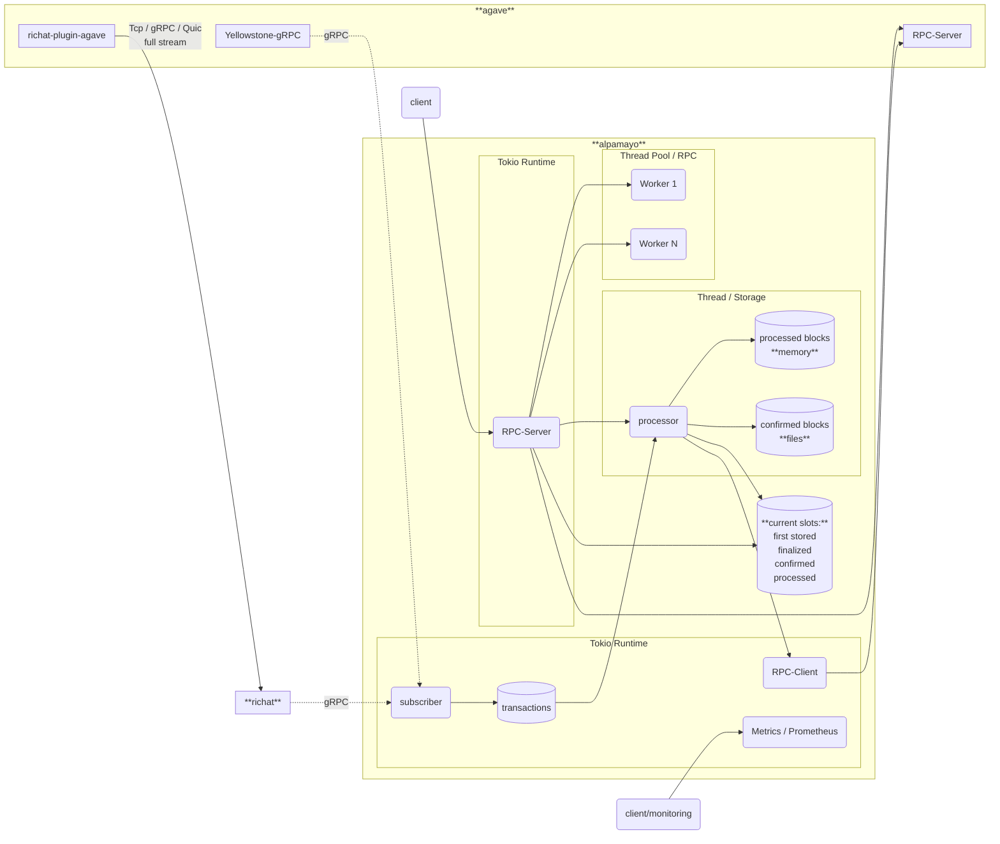

# alpamayo

Lightweight drop-in replacement for the Solana RPC stack, designed for frozen data (blocks, transactions, etc.).

Please use issues only for reporting bugs or discussing feature-related topics. If you're having trouble running alpamayo or need insights about the configuration, please post your question in the Telegram group: [https://t.me/lamportsdev](https://t.me/lamportsdev)

## Sponsored by

## Supported methods

### Solana Rpc methods:

#### Blocks based

- [x] `getBlock`
- [x] `getBlockHeight`
- [x] `getBlocks`
- [x] `getBlocksWithLimit`
- [x] `getBlockTime`
- [x] `getFirstAvailableBlock`
- [x] `getLatestBlockhash`
- [x] `getRecentPrioritizationFees`
- [x] `getSignaturesForAddress`
- [x] `getSignatureStatuses`
- [x] `getSlot`
- [x] `getTransaction`
- [x] `isBlockhashValid`

#### Smart cache

- [x] `getClusterNodes`
- [x] `getInflationReward`
- [x] `getLeaderSchedule`

#### Static

- [x] `getVersion`

### Extra methods:

- [x] `/block/${slot}`
- [x] `/tx/${signature}`
- [x] `/version`

## Blueprint



## Configuration

### Multiple Upstream Support

Alpamayo supports routing different RPC methods to different upstream endpoints. This feature allows you to optimize performance by directing requests to specialized RPC nodes based on the method being called.

#### Basic Configuration

To enable multiple upstreams, use the `upstream_jsonrpc_multiple` configuration in your `config.yml`:

```yaml
rpc:
  upstream_jsonrpc_multiple:
    default: "main"  # Default upstream for unrouted methods
    endpoints:
      main:
        endpoint: http://127.0.0.1:8899
        user_agent: alpamayo/v0.1.0
        version: HTTP/1.1
        timeout: 30s
      archive:
        endpoint: http://archive.example.com:8899
        user_agent: alpamayo/v0.1.0
        version: HTTP/1.1
        timeout: 60s  # Longer timeout for historical queries
      fast:
        endpoint: http://fast.example.com:8899
        user_agent: alpamayo/v0.1.0
        version: HTTP/2.0
        timeout: 10s  # Shorter timeout for real-time data
    method_routing:
      # Route historical data requests to archive server
      getBlock: "archive"
      getTransaction: "archive"
      # Route real-time requests to fast server
      getSlot: "fast"
      getBlockHeight: "fast"
      getLatestBlockhash: "fast"
```

#### Backward Compatibility

The multiple upstream feature is fully backward compatible. If you're using the legacy single upstream configuration (`upstream_jsonrpc`), it will continue to work without any changes:

```yaml
rpc:
  # Legacy single upstream configuration (still supported)
  upstream_jsonrpc:
    endpoint: http://127.0.0.1:8899
    user_agent: alpamayo/v0.1.0
    version: HTTP/1.1
    timeout: 30s
```

#### Configuration Options

- **default**: The name of the default upstream to use for methods not explicitly routed
- **endpoints**: A map of upstream names to their configurations
  - **endpoint**: The HTTP(S) URL of the upstream RPC server
  - **user_agent**: The User-Agent header to send (optional)
  - **version**: HTTP version to use (HTTP/1.1 or HTTP/2.0)
  - **timeout**: Request timeout duration
- **method_routing**: A map of RPC method names to upstream names

#### Use Cases

1. **Archive Node Routing**: Route historical data queries (`getBlock`, `getTransaction`) to dedicated archive nodes with larger storage
2. **Real-time Data Optimization**: Route time-sensitive queries (`getSlot`, `getLatestBlockhash`) to low-latency nodes
3. **Load Distribution**: Distribute different types of requests across multiple RPC providers
4. **Failover Support**: Configure multiple endpoints for redundancy (requires additional configuration)

For a complete example configuration, see `config-multiple-upstream-example.yml`.
